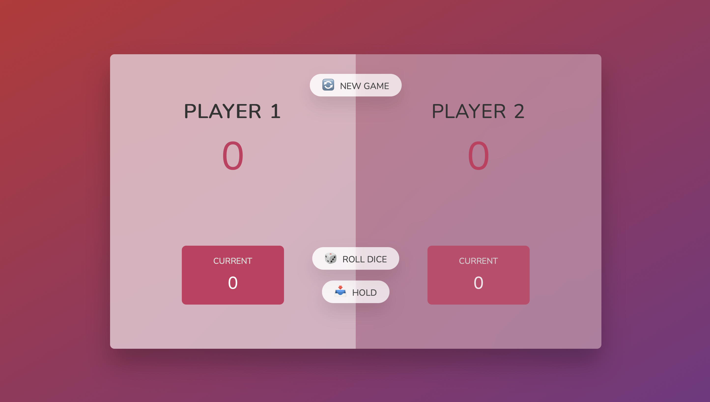

# 🎲 Game of Pig

A simple browser-based dice game built with HTML, CSS, and JavaScript.

## 🎮 Game Rules

- Two players take turns.
- On each turn, a player rolls a die:
  - If they roll any number except **1**, it gets added to their current score.
  - If they roll a **1**, they lose the current score and it's the next player’s turn.
- At any time, the player can **"Hold"**:
  - Their current score is added to their total score.
  - Then it's the next player’s turn.
- First player to reach **100 points** wins.

## 🛠️ Technologies Used

- HTML5
- CSS3
- Vanilla JavaScript

## 💡 Features

- Two-player mode (local)
- Dynamic score updates
- Roll and hold mechanics
- Game reset functionality
- Responsive design

## 📷 Screenshots



## 🚀 Getting Started

To run the game locally:

1. Clone the repository:
   ```bash
   git clone https://github.com/tonidujic/GameOfPig.git

2. Open index.html in your browser.

Enjoy playing! 🎉   
